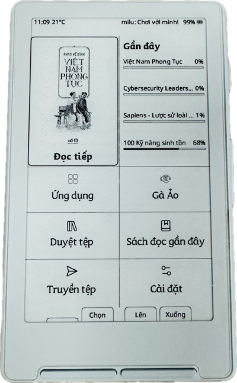

# CrossPet Reader

**Custom firmware for Xteink X4 e-reader — custom fonts, flashcards, Bluetooth keyboard, and more.**

CrossPet is a Vietnamese fork of [CrossPoint Reader](https://github.com/crosspoint-reader/crosspoint-reader) — open-source firmware for the **Xteink X3 / X4** e-paper readers.



---

## What's New in v1.8.3

- **Custom fonts from SD card** — Drop `.bin` fonts into `/fonts/`, select in settings. Dual font model: primary + supplement for mixed scripts (e.g. Latin + CJK). Generate `.bin` files at [xteink.lakafior.com](https://xteink.lakafior.com/)
- **Flashcards** — SM-2 spaced repetition. Import `.csv` decks from SD card via in-app file picker
- **Bluetooth keyboard (beta)** — Pair a BLE page turner or keyboard. Separate firmware build due to memory constraints

---

## Features

### Reading Experience
- **EPUB 2/3** with images, CSS styling, and multi-language hyphenation
- **XTC** pre-rendered format (>2GB support) and **TXT/Markdown**
- **3 built-in fonts** (Bookerly, Lexend, Bokerlam) + **custom fonts from SD card**
- **4 font sizes** with anti-aliased grayscale rendering
- **Font cache** for faster page turns + silent next-chapter pre-indexing
- **Auto page turn** — 1-20 pages/min, configurable as power button action
- **Bookmarks** via long-press, reading stats & streaks
- **Dark mode**, 5 UI themes, fully customizable status bar
- **9 sleep screen modes** — Clock, Reading Stats, Page Overlay, custom images, and more
- **Focus mode** — hides all extras, just you and your books
- **KOReader Sync** for cross-device progress
- **4 screen orientations** with remappable buttons
- **9 power button actions** per single/double/triple click

### Apps
| App | Description |
|-----|-------------|
| **Flashcards** | SM-2 spaced repetition with SD card deck import |
| **Virtual Pet** | Tamagotchi chicken — evolves with reading |
| **Clock** | Digital clock + lunar calendar |
| **Weather** | Open-Meteo (no account needed) |
| **Pomodoro** | Work/break timer |
| **Sleep Image** | 9 sleep screen modes with image picker |
| **OPDS Browser** | Browse & download from Calibre/OPDS |
| **Games** | Chess, Caro, Sudoku, Minesweeper, 2048 |

### Connectivity
- WiFi file transfer from browser
- OPDS / Calibre library browsing
- KOReader Sync
- OTA firmware updates
- BLE keyboard (beta, separate build)

### Bluetooth Keyboard (Beta)

Pair a BLE page turner or keyboard. Available as a **separate firmware download**.

| Key | Reader | Menus |
|-----|--------|-------|
| Arrow keys | Page turn | Navigate |
| Enter | Select | Select |
| Escape | Back | Back |

Supports: GameBrick V1/V2, Free2/Free3, Kobo Remote, generic HID.

> BLE uses ~50KB RAM. The BLE build disables images and CSS to fit. WiFi and BLE share one radio — they can't run simultaneously.

---

## Installing

### Web Flasher

1. Connect X3/X4 via USB-C, wake the device
2. Go to https://xteink.dve.al/ and flash

### Manual

```sh
git clone --recursive https://github.com/trilwu/crosspet
pio run --target upload
```

### Build Environments

```bash
pio run -e default      # Standard build
pio run -e ble          # Bluetooth build (beta)
pio run -e gh_release   # Release build
```

---

## SD Card Setup

```
/fonts/          # Custom fonts (Xteink .bin format: FontName_size_WxH.bin)
/flashcard/      # Flashcard decks (.csv, imported via in-app file picker)
/sleep/          # Sleep screen images (PNG/BMP)
```

### Adding Custom Fonts

1. Go to [xteink.lakafior.com](https://xteink.lakafior.com/) — the Xteink web font maker
2. Upload a `.ttf` / `.otf`, tune weight + anti-aliasing in the live preview
3. Click **Convert to .BIN**
4. Rename to `FontName_size_WxH.bin` — e.g. `Lexend_38_33x39.bin` (the firmware parses size + glyph box from the filename)
5. Copy into SD `/fonts/` and reboot. The font appears in **Settings → Font**

Dual-font: pick a **primary** (e.g. Latin) and **supplement** (e.g. CJK) — mixed-script text renders correctly without glyph fallback gaps.

### Adding Flashcards

Decks are CSV files. Header row required:

```csv
card_id,front_content,back_content,sr_due,sr_interval,sr_ease
1,"What is 2+2?","4",,,
2,"Bonjour \ greeting \","Hello",,,
3,"Line one/nLine two","Back side",,,
```

- **SRS fields** (`sr_due`, `sr_interval`, `sr_ease`) — leave empty for new cards; the app fills them in on review
- **Hint syntax** — wrap an optional hint inside `\ ... \` in `front_content` (shown smaller/dimmer during review)
- **Newlines** — encode as `/n` inside a field
- Max 500 cards per deck

**Import:** Put the `.csv` anywhere on the SD card → launch **Flashcards** app → **Import** → pick file. The app copies it into `/flashcard/` and derives the deck name from the filename (`my_deck.csv` → *my deck*). Review settings (new cards/day, max reviews/day) live in the app's settings screen.

---

## Contributing

1. Fork → branch → changes → PR

See [contributing docs](./docs/contributing/README.md).

---

CrossPet Reader is **not affiliated with Xteink**. Based on [CrossPoint Reader](https://github.com/crosspoint-reader/crosspoint-reader).
